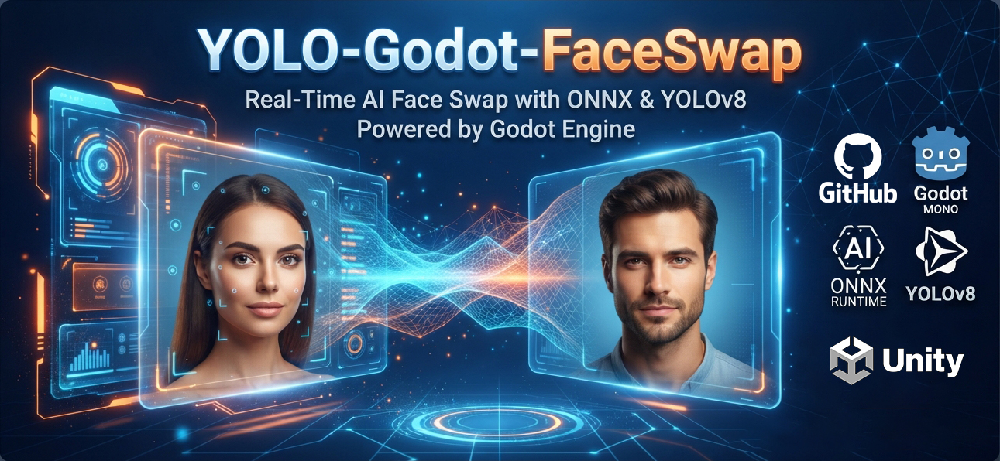

# YOLO-Unity-FaceSwap

[English](#english) | [中文说明](#chinese)


---
<a name="english"></a>
## 🚀 Overview
**YOLO-Unity-FaceSwap** is a high-performance offline AI face swap and enhancement component powered by **ONNX Runtime**, **OpenCvSharp**, **YOLOv8**, and **GFPGAN**, tailored specifically for game engines like **Unity** and **Godot Mono**[cite: 1, 2, 5, 8, 11].

### Key Features
- **Fully Offline & Local**: Runs entirely on-device with zero internet required, ensuring complete user data privacy and zero latency.
- **Complete AI Pipeline**: Integrates YOLOv8 (face detection), 2DFAN (68-landmark alignment), ArcFace (512-dim embedding), InSwapper (face swapping), and GFPGAN (restoration and enhancement)[cite: 1, 2, 5, 6, 7, 8].
- **Engine Friendly**: Pre-cached template system and multi-threaded background task execution designed to prevent main-thread stuttering.

### 📦 Model Files Download
You can download all required ONNX models, transformation matrices, and template images from the Google Drive link below[cite: 11]:
- **[📥 Google Drive Model Files Download](https://drive.google.com/drive/folders/1FVUaNLaR5eCKxfJuS_qWGTsF2jw_IF5v?usp=drive_link)**[cite: 11]
*(Please place the downloaded model files into your project's `Models/` and `Images/` directories).*

### 🛠️ Quick Start & Usage (C# / Unity / Godot)
1. **Engine Warm-up**: Initialize and load models into memory on a background thread during startup (`ExchangeFace.Prehear`).
2. **Configure Mode**: Set `Data.name` to `"male"`, `"female"`, or `"both"` depending on your template requirement.
3. **Request Swap**: Invoke the face swap manager asynchronously to prevent main-thread freezing.

### 📜 License
This project is licensed under the **GNU Affero General Public License v3.0 (AGPL-3.0)**. Unauthorized proprietary commercial use or SaaS deployment without open-sourcing the derivative work is strictly prohibited.

---

<a name="chinese"></a>
## 🚀 概述
**YOLO-Unity-FaceSwap** 是一个基于 **ONNX Runtime**、**OpenCvSharp**、**YOLOv8** 和 **GFPGAN** 构建的高性能离线 AI 换脸与画质修复组件，专为 **Unity** 和 **Godot Mono** 等游戏引擎设计[cite: 1, 2, 5, 8, 11]。

### 核心特性
- **完全离线运行**：无需联网，所有 AI 推理均在本地执行，严防数据泄露，保障隐私安全[cite: 5]。
- **完整流水线**：集成 YOLOv8（人脸检测）、2DFAN（68关键点对齐）、ArcFace（512维特征提取）、InSwapper（核心换脸）以及 GFPGAN（高清修复与细节增强）[cite: 1, 2, 5, 6, 7, 8]。
- **引擎优化**：内置多线程后台异步预热与任务调度机制，完美避免游戏主线程卡顿[cite: 5]。

### 📦 模型与权重文件下载
项目运行所需的 ONNX 模型、矩阵配置文件及默认模板，请通过以下网盘链接下载并放置于项目的 `Models/` 及 `Images/` 目录下[cite: 11]：
- **[📥 点击下载 Google Drive 模型文件](https://drive.google.com/drive/folders/1FVUaNLaR5eCKxfJuS_qWGTsF2jw_IF5v?usp=drive_link)**[cite: 11]

---

## 📖 详细接入与调用指南 (Detailed Guide)

### 1. 环境依赖配置
请确保您的项目环境满足：
- **运行环境**：.NET Standard 2.1 或 .NET 6/8
- **核心 NuGet 依赖**：
  - `Microsoft.ML.OnnxRuntime` (支持 CPU / CUDA 硬件加速)[cite: 1, 2, 6, 7, 8]
  - `OpenCvSharp4` 及其宿主平台原生库 (`OpenCvSharp4.runtime.win` 等)[cite: 1, 2, 3, 5, 6, 7, 8]

### 2. 核心调用与使用步骤

#### 步骤一：后台预热模型（Prehear）
在程序启动时，通过后台线程将所有 ONNX 模型加载到内存并缓存模板特征，避免运行时产生严重卡顿[cite: 5, 9]：
```csharp
Task.Run(() => {
    ExchangeFace.Prehear();
});
